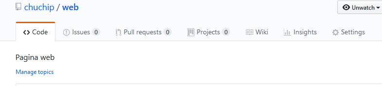

#
Pagina Web en GitHub

Lo primero es crear nuestro proyecto en [GitHub](https://www.github.com), para lo cual deberemos estar registrados. 

Estos pasos son muy sencillos pero teneis que tener al menos ciertas nociones basicas de [Git](https://git-scm.com/book/es/v2) pues se utilizara esta herramienta para subir los ficheros que formaran la pagina web.

Teneis muchos videos y manuales que explican como crear una página web, uno donde se explica incluso como crear la página web lo teneis en [devCode.la](https://devcode.la/tutoriales/publicar-tu-web-usando-github-pages/)

Una vez tengamos creado nuestro proyecto, deberemos hacer al menos un  **push**. Es decir subir a **GitHub** al menos un fichero.

Ahora, para especificar que queremos tener una pagina web para nuestro proyecto,  iremos a "**Settings**"

y bajaremos hasta que veamos la sección: **GitHub Pages**

Ahora eligiremos el branch (es decir, la rama) donde estara nuestra pagina web. Para empezar simplemente usar el valor que aparece por defecto: **master branch**. El tema de _'ramas'_ es ampliamente utilizado en GIT pero si solo queremos hacer una pagina web no necesitamos crear ninguna.

Ahora deberemos elegir que _tema_ vamos a utilizar para nuestra pagina web. Aunque tenemos la opción de no utilizarlo como explico más adelante, pero **es obligatorio** elegir un _tema_.

Tenemos la opción de tener un dominio propio tipo **www.midominio.com**, el cual, logicamente, deberemos tener registrado previamente. Si no tenemos un dominio propio nuestra pagina web sera visible bajo el dominio: http://USUARIO.github.com/PROYECTO

Tenemos dos formas de crear nuestra pagina web

- Utilizando un _tema_ 
- Sin plantilla para lo cual tendremos un fichero **index.html**.

##Trabajando con un tema

Si elegimos usar un _tema_ lo que se mostrara sera el fichero **readme.md** que tengamos, maquetado según el _tema_ elegido.
En este fichero **readme.md** podremos usar el lenguaje de maquetado [MarkDown](https://es.wikipedia.org/wiki/Markdown) con el que podremos poner imagenes, formatear nuestro texto (poner negritas, cursiva, etc), poner enlaces, etc.

Para poner enlaces  a las imagenes se podra usar el formato: `./IMAGEN_A_ENLAZAR`

##Pagina web estatica

Si hemos creado  un fichero **index.html**, este fichero se utilizara como página inicial de nuestra página web.

Todas las referencias a imagenes, ficheros *CSS*  o ficheros javascript que queramos poner deberan ser con el formato:

`https://raw.githubusercontent.com/USUARIO/web/master/IMAGEN_A_MOSTRAR`

Es decir si el usuario es 'chuchip' y el proyecto se llama web, todas las referencias a imagenes deberan ser:

https://raw.githubusercontent.com/chuchip/web/master/

Aclarar que si tenemos el fichero **index.html** no utilizara el _tema_ ni se vera el fichero **readme.md**

Otra cosa a tener en cuenta que a GitHub le cuesta un poco (menos de un minuto), refrescar la pagina web desde el ultimo _push_

Y con esto ya tendreis vuestra pagina web alojada gratuitamente. 

Ah, y ademas, sera visible bajo el protocolo https (es decir con seguridad) pues github lo provee automaticamente.

